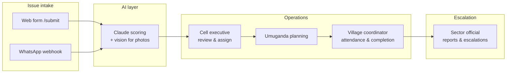

# Tubyikorere

**Demo video:** [Watch on YouTube](https://youtu.be/CG9-5zRndXE)

**Let's handle it together** — an AI-powered community governance platform for Rwanda.

Citizens report local problems (roads, water, safety, environment). Claude scores severity and recommends actions. Cell executives plan **Umuganda** (monthly community work). Village coordinators record attendance and outcomes. Sector officials review reports and escalations.

---

## How the app works



### End-to-end flow

1. **Report** — A citizen submits an issue via the public web form or WhatsApp (text + optional photo).
2. **Score** — The API sends the description (and photo URL when present) to Claude. It returns category, severity (1–5), summary, recommended action, and whether escalation is needed.
3. **Review** — The cell executive sees prioritized issues on their dashboard, updates status, and assigns work to the next Umuganda session.
4. **Plan** — Claude generates group assignments (participants, tasks, materials) for the session based on selected issues.
5. **Execute** — Village coordinators record attendance and mark work as resolved, partial, or escalated.
6. **Report** — The cell executive generates an AI-written sector report; the sector official reviews escalations and submitted reports.

### Rwanda administrative hierarchy

Every location in the database follows the official structure:

```
Province (5) → District (30) → Sector (416) → Cell (2,148) → Village (14,842)
```

The web submit form uses cascading selects for all five levels. Location data is seeded from the [DevRW/rwanda-location](https://github.com/DevRW/rwanda-location) dataset.

---

## Monorepo structure

```
tubyikorere/
├── apps/
│   ├── web/          React + Vite frontend (Vercel)
│   └── api/          Hono API + Drizzle (Railway)
├── packages/
│   └── shared/       Shared types (optional)
├── docs/             Product & design references
└── .github/workflows/ci.yml
```

| App | Stack | Purpose |
|-----|--------|---------|
| **web** | React 19, Vite, Tailwind 4, shadcn/ui, TanStack Query, Zustand | Portals for citizens, coordinators, cell execs, sector officials, admin |
| **api** | Hono, Drizzle ORM, Postgres, Anthropic SDK, Twilio, Supabase Storage | REST API, WhatsApp webhook, Claude integration, photo uploads |

---

## User roles & routes

| Role | Login | Base route | Main jobs |
|------|--------|------------|-----------|
| **Citizen** | None | `/`, `/submit`, `/track` | Report issues, track by reference ID |
| **Village coordinator** | Phone + PIN | `/coordinator` | View assignment, record attendance, submit work outcomes |
| **Cell executive** | Phone + PIN | `/cell-executive` | Dashboard, issue triage, Umuganda planning, sector reports |
| **Sector official** | Phone + PIN | `/sector-official` | Sector overview, reports, escalations, cell list |
| **Admin** | Phone + password | `/admin` | Hierarchy, users, activity |

Phone numbers accept `078...`, `+25078...`, or `25078...` (normalized to E.164 on submit).

Global toast notifications (success / error / info) use [Sonner](https://sonner.emilkowal.ski/) via `RootLayout`.

---

## Key features

### Public issue submission (`/submit`)

- Full location picker: Province → District → Sector → Cell → Village
- Free-text description (Kinyarwanda or English)
- Optional phone for follow-up
- Optional site photo — converted to **WebP** in the browser for smaller uploads
- **Async upload**: issue is created immediately; photo is attached in the background with user-friendly toasts

### WhatsApp intake (`POST /webhook/whatsapp`)

- Twilio sandbox or production WhatsApp sender
- Text messages scored and saved as issues
- Image attachments: downloaded from Twilio, converted to WebP server-side (`sharp`), stored in Supabase
- Demo routing: issues attach to the **Bibare** cell (Kimironko sector, Gasabo) unless configured otherwise via `DEMO_CELL_ID`

### AI (Claude)

- **Issue scoring** — category, severity, summary, participants estimate, escalation flag
- **Vision** — when a photo URL is present, Claude uses it for severity assessment
- **Umuganda planning** — group assignments from prioritized issues
- **Sector reports** — formal report text from session data

Model default: `claude-haiku-4-5-20251001` (override with `ANTHROPIC_MODEL`).

### Photo storage

- Supabase bucket `issue-photos` (configurable)
- JPEG, PNG, WebP; max 5 MB
- Public URLs stored on `issues.photo_url`

---

## Getting started

### Prerequisites

- Node.js 20+
- [pnpm](https://pnpm.io/) 9+
- PostgreSQL (e.g. [Supabase](https://supabase.com/) database URL)
- Anthropic API key
- Optional: Twilio account (WhatsApp), Supabase project (storage)

### Install

```bash
git clone <repo-url>
cd tubyikorere
pnpm install
```

### Environment

Copy examples and fill in values:

```bash
cp apps/api/.env.example apps/api/.env
cp apps/web/.env.example apps/web/.env
```

See [Environment variables](#environment-variables) below.

### Database

```bash
pnpm --filter api db:push    # apply schema
pnpm --filter api db:seed    # Rwanda locations + demo data (~30s)
pnpm --filter api db:ensure-demo   # idempotent demo PINs (optional if seed already set them)
```

Seed loads **5 provinces, 30 districts, 416 sectors, 2,148 cells, 14,842 villages** plus 5 sample issues in the demo cell.

### Run locally

```bash
pnpm dev
```

- Web: http://localhost:5173  
- API: http://localhost:3001  
- Health: http://localhost:3001/health  

### Quality checks

```bash
pnpm check    # lint + build
```

---

## Demo credentials

Demo cell: **Bibare** (Kimironko sector, Gasabo district, Kigali City).

| Role | Phone | PIN / password |
|------|--------|----------------|
| Cell executive | `+250788000001` | `1234` |
| Coordinator (Abatuje) | `+250788000002` | `2345` |
| Coordinator (Amariza) | `+250788000003` | `2345` |
| Coordinator (Imanzi) | `+250788000004` | `2345` |
| Sector official | `+250788000010` | `5678` |
| Admin | `+250788000099` | `admin123` |

Reset demo issues/sessions without re-seeding:

```bash
pnpm --filter api db:reset-demo
```

---

## API overview

| Area | Prefix | Notes |
|------|--------|--------|
| Auth | `/api/auth` | Login, change PIN |
| Locations | `/api/locations` | Public cascade: provinces → villages |
| Issues | `/api/issues` | Create, list, track, status, background photo attach |
| Umuganda | `/api/umuganda` | Sessions, AI plan generation |
| Attendance | `/api/attendance` | Session attendance records |
| Reports | `/api/reports` | Sector report generation |
| Cells / Coordinator / Sector | `/api/cells`, `/api/coordinator`, `/api/sector` | Role-scoped data |
| Admin | `/api/admin` | Hierarchy & user management |
| Webhook | `/webhook/whatsapp` | Twilio WhatsApp (public) |

Protected routes expect headers: `x-cell-id`, `x-sector-id`, or `x-admin-token` (set by the web app after login).

---

## WhatsApp local testing

1. Set `TWILIO_ACCOUNT_SID`, `TWILIO_AUTH_TOKEN`, `TWILIO_WHATSAPP_FROM` in `apps/api/.env`.
2. Expose the API (e.g. [cloudflared](https://developers.cloudflare.com/cloudflare-one/connections/connect-networks/) or ngrok): `https://<tunnel>/webhook/whatsapp`.
3. Configure the Twilio WhatsApp sandbox **When a message comes in** to that URL.
4. Send a message to the sandbox number from a verified phone.

---

## Deployment

| Component | Typical host | Notes |
|-----------|--------------|--------|
| API | [Railway](https://railway.app/) | Root `pnpm start` → `tsx src/index.ts`; set all `apps/api/.env` vars |
| Web | [Vercel](https://vercel.com/) | Set `VITE_API_URL` to Railway URL (no `/api` suffix); SPA rewrites in `vercel.json` |
| Database | Supabase Postgres | `DATABASE_URL` |
| Photos | Supabase Storage | `SUPABASE_*` vars on Railway |

After deploy, run `pnpm --filter api db:seed` against production DB once if locations are empty.

---

## Environment variables

### API (`apps/api/.env`)

| Variable | Required | Description |
|----------|----------|-------------|
| `DATABASE_URL` | Yes | Postgres connection string |
| `ANTHROPIC_API_KEY` | Yes | Claude API |
| `CLIENT_URL` | Prod | Comma-separated allowed CORS origins (Vercel URL) |
| `SUPABASE_URL` | Photos | Supabase project URL |
| `SUPABASE_SERVICE_KEY` | Photos | Service role key |
| `SUPABASE_STORAGE_BUCKET` | Photos | Default `issue-photos` |
| `TWILIO_ACCOUNT_SID` | WhatsApp | Twilio credentials |
| `TWILIO_AUTH_TOKEN` | WhatsApp | Twilio credentials |
| `TWILIO_WHATSAPP_FROM` | WhatsApp | e.g. `whatsapp:+14155238886` |
| `DEMO_CELL_ID` | No | Default Bibare cell UUID |
| `ADMIN_PHONE` / `ADMIN_PIN` | No | Admin login defaults |
| `ADMIN_API_TOKEN` | No | Admin API header token |

### Web (`apps/web/.env`)

| Variable | Description |
|----------|-------------|
| `VITE_API_URL` | API base URL, e.g. `http://localhost:3001` |
| `VITE_DEMO_CELL_ID` | Optional; demo cell for dev |
| `VITE_ADMIN_API_TOKEN` | Must match API `ADMIN_API_TOKEN` for admin UI |

---

## Scripts

| Command | Description |
|---------|-------------|
| `pnpm dev` | Run web + API concurrently |
| `pnpm dev:web` | Frontend only |
| `pnpm dev:api` | API only |
| `pnpm check` | Lint + build |
| `pnpm start` | Production API (Railway) |
| `pnpm --filter api db:push` | Push Drizzle schema |
| `pnpm --filter api db:seed` | Full location seed + demo issues |
| `pnpm --filter api db:reset-demo` | Reset demo cell issues/sessions |

---

## Further reading

- [`docs/tubyikorere_agent_brief.md`](docs/tubyikorere_agent_brief.md) — product vision, schema, and build decisions  
- [`docs/tubyikorere_user_flow.md`](docs/tubyikorere_user_flow.md) — page-by-page user flows  
- [`docs/tubyikorere-design-system.md`](docs/tubyikorere-design-system.md) — UI tokens and patterns  

---

## License

Private hackathon project. See repository for license terms if applicable.
